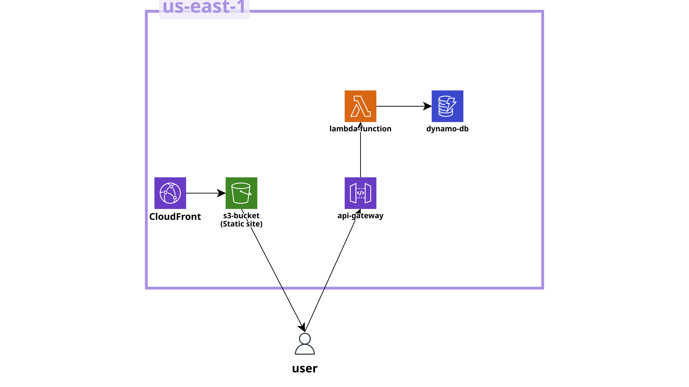

create s3 bucket
-block public access
create cloudfront distribution
-root folder: /index.html
-choose the s3 bucket as origin
-ensure policy is updated in s3
-add error page to ensure good SPA routing
-